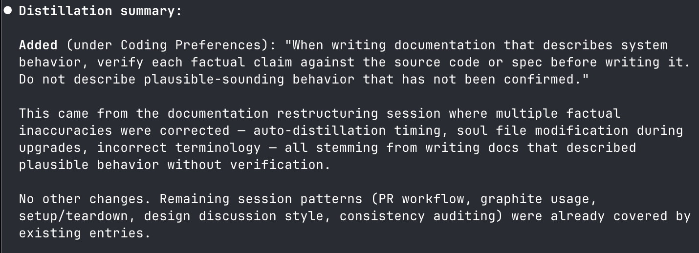

# Leiter

_Your partner agent who learns as you work._

Leiter makes [Claude Code](https://docs.anthropic.com/en/docs/claude-code) learn your preferences automatically — no
manual steps after installation. It quietly improves in the background over time.

Inspired by [Joe Romano](https://github.com/joerromano), who was inspired by
[Matt Greenfield](https://www.threads.com/@sobri909)'s
[thread on the topic](https://www.threads.com/@sobri909/post/DSOrEqlEd8u/just-got-claude-to-do-another-consolidation-on-its-partner-model-md-file-the).

Here is an example of it learning:

## Quickstart

- `brew install scode/dist-tap/leiter`
- `leiter claude install`
- Start a new claude session and run `/leiter-setup` and follow the instructions.
- If you did not enable auto-distillation during setup, remember to run `/leiter-distill` every now and then (once a day
  or so) to apply learnings from past sessions.

For more details, including if you cannot or do not want to use Homebrew, see [docs/setup.md](docs/setup.md) for the
full setup guide.

## How It Works

Leiter maintains a "soul" - a markdown file in `~/.leiter/soul.md` - which contains instructions for how the agent
should behave. The soal is updated based on distilling learnings from session logs (and can also be directly updated
when prompted to). You can think of the soul file as an auto-updating personal CLAUDE.md file.

Here's the TLDR of the mechanics:

- **Session start:** Your soul file is injected into the session as context, so the agent starts with your preferences
  already loaded.
- **During the session:** Just do what you normally do.
- **During the session (OPTIONAL):** You can directly trigger immediate soul updates by saying something like "Instill
  that I never want you to create a PR unless explicitly asked."
- **Session end:** The session transcript is automatically saved to a log directory under `~/.leiter`.
- **Distillation:** This refers to "distilling" the logs to extract learnings, and updating the soul. This can be
  automatic or manual.
  - If you chose auto-distillation during `/leiter-setup`, leiter will periodically launch automatic distilliation in a
    background agent after the first turn in a session.
  - Otherwise, or in addition to automatic distillation, you can run `/leiter-distill` at any time to trigger immediate
    distillation.
    - NOTE: The _current session_ is not capture during distillation because it has not yet been logged. If that is what
      you want, first `/clear` or exit claude and resume the session.

See [docs/how-it-works.md](docs/how-it-works.md) for the full picture.

## Usage

The quickstart above is all you need to use it. A little more details and guidance on whether to enable
auto-distillation during setup is in [docs/usage.md](docs/usage.md).

If you want to change your choices made during `/leiter-setup`, simply run `/leiter-teardown` followed by running
`/leiter-setup` again.

## Uninstalling

- Run `/leiter-teardown` in a session.
- Run `leiter claude uninstall`.
- Uninstall the binary (e.g. `brew uninstall leiter`).

This will leave your soul intact, as well as any undistilled session logs in `~/.leiter`. You are free to remove them if
you would like.
