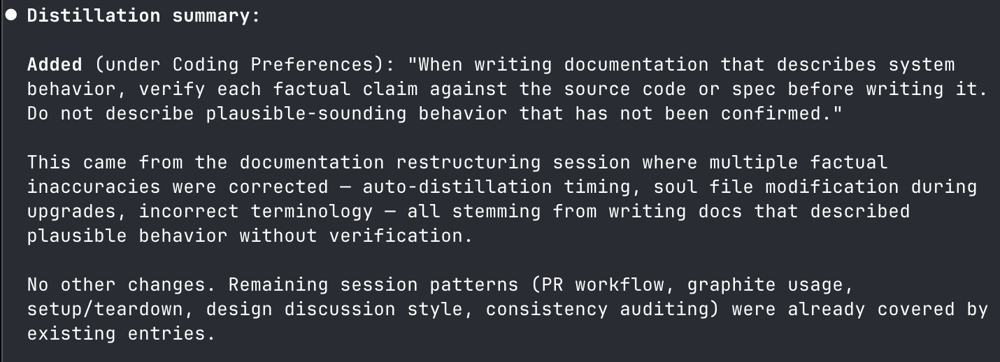

# Leiter

_Your partner agent who learns as you work._

Leiter makes [Claude Code](https://docs.anthropic.com/en/docs/claude-code) learn your preferences automatically — no
manual steps after installation. It quietly improves in the background over time.

Inspired by [Joe Romano](https://github.com/joerromano), who was inspired by
[Matt Greenfield](https://www.threads.com/@sobri909)'s
[thread on the topic](https://www.threads.com/@sobri909/post/DSOrEqlEd8u/just-got-claude-to-do-another-consolidation-on-its-partner-model-md-file-the).

Here is an example of it learning:

## Quickstart

- `brew install scode/dist-tap/leiter`
- `leiter claude install`

That is the whole setup. `leiter claude install` runs once in your terminal — there is no in-session step and no hooks
to configure. Your soul is delivered through a managed block in `~/.claude/CLAUDE.md`, so it loads in every new Claude
Code session.

Distillation is manual by default. Say "distill" in a session, or run `leiter distill` from a shell every so often (once
a day or so), to fold what leiter learned from your recent sessions into the soul. `leiter distill` is non-interactive,
so you can put it on a cron job instead. Run `leiter status` to see how many sessions are waiting to be distilled.

For more details, including if you cannot or do not want to use Homebrew, see [docs/setup.md](docs/setup.md).

**Upgrading from a pre-0.9.0 (hook-based) setup?** Older leiter used Claude Code hooks. That is gone. When you upgrade
the binary, your still-configured hooks detect the mismatch and tell you to run `leiter claude install`, which migrates
your box to the hookless layout and prints instructions for removing the leftover hooks. You can also just run
`leiter claude install` directly. See [docs/setup.md](docs/setup.md) for the details.

## How It Works

Leiter maintains a "soul" — a markdown file in `~/.leiter/soul.md` — which contains instructions for how the agent
should behave. The soul is updated by distilling learnings from your session transcripts, and can also be updated
directly when you ask. Think of it as an auto-updating personal `CLAUDE.md`. Ask the agent to "show my soul" any time to
see it.

Here's the TLDR of the mechanics:

- **Session start:** Your soul is delivered into the session through a managed block in `~/.claude/CLAUDE.md` that
  Claude Code already reads, so the agent starts with your preferences loaded. No hook is involved.
- **During the session:** Just do what you normally do.
- **During the session (OPTIONAL):** You can directly trigger an immediate soul update by saying something like "Instill
  that I never want you to create a PR unless explicitly asked."
- **Distillation:** "Distilling" reads your recent session transcripts and folds any new patterns into the soul. Say
  "distill" in a session, or run `leiter distill` from a shell or cron. It reads Claude Code's own session store
  directly, so there is nothing to save or export first.

See [docs/how-it-works.md](docs/how-it-works.md) for the full picture.

## Usage

The quickstart above is all you need to use it. [docs/usage.md](docs/usage.md) covers instilling preferences,
distillation and cron, `leiter status`, and working with the soul file directly.

## Uninstalling

- Run `leiter claude uninstall` to remove the managed block and the `leiter` skill from `~/.claude/`.
- Uninstall the binary (e.g. `brew uninstall leiter`).

This leaves your soul and state under `~/.leiter/` intact. You are free to remove that directory if you want a clean
slate.

## Other topics

- [Should I grant permission to run leiter:\* commands?](docs/leiter_command_permissions.md)
